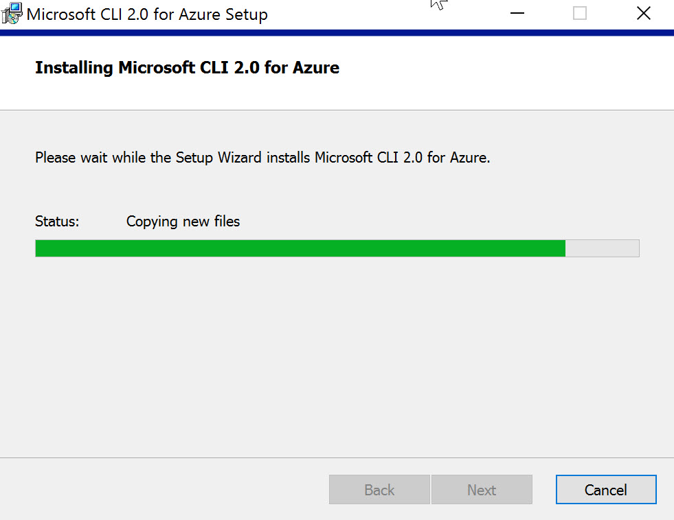
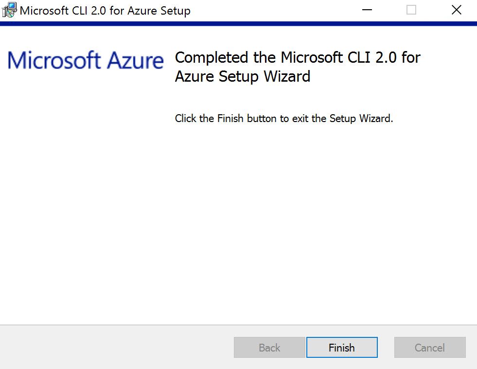
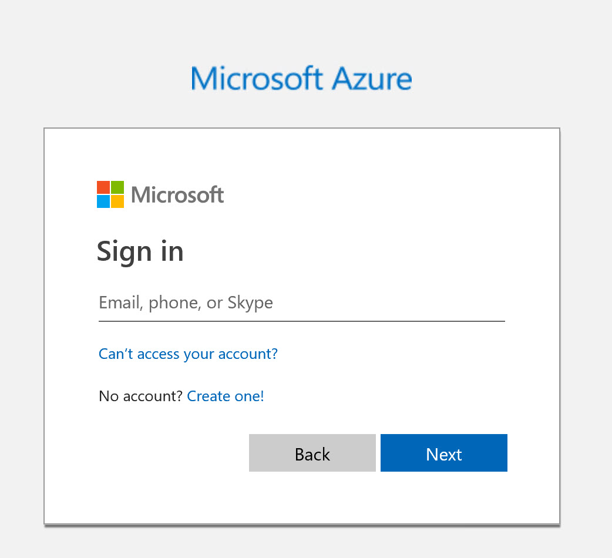
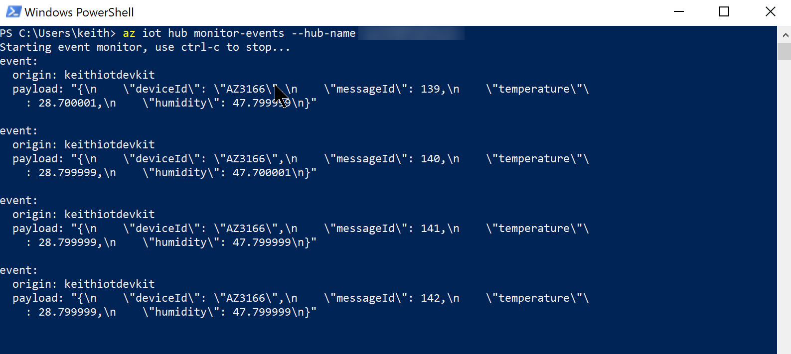

# 
How to monitor your Azure IoT Hub messages from Azure CLI

- - - 

We have a lot of people who ask “How can I monitor the messages coming into the IoT Hub?”  In truth, there are a lot of different ways to view the message traffic, and while one way is not better than others, some are simpler to configure.  In this article we will be looking at how to setup Azure CLI to monitor the IoT Hub Message traffic.

The benefit of using Azure CLI is that it is a cross platform tool, meaning, that you can run on Windows, Mac, or Linux.  The LI is designed to make scripting easy, query data, support long running operations and much more.  While you can install the Azure CLI on several different operating systems, for the purpose of this article we will be installing it on Windows.

## Install the Azure CLI 2.0
- - - 

Getting started you will need to:

- Download the MSI Package from [here](https://aka.ms/installazurecliwindows).  
- The instructions can be found [here](https://docs.microsoft.com/en-us/cli/azure/install-azure-cli-windows?view=azure-cli-latest).
- To install the Azure CLI for other operating systems click [here](https://docs.microsoft.com/en-us/cli/azure/install-azure-cli?view=azure-cli-latest).

After downloading the MSI Package run it:





Click Next



After it is finished the installation click on finish



## Install the Azure IoT CLI Extension
- - - 

Now that the Azure CLI tool is installed we need to extend it be able to use IoT CLI tools.  To do this we will install the [Azure IoT Extension for Azure CLI](https://github.com/Azure/azure-iot-cli-extension/blob/master/README.md).  This will provide the IoT commands and capabilities that are focused around the IoT Hub and Device Provisioning services.  

To install the Azure IoT Extension for Azure CLI you will perform the following steps:

  * from the an elevated PowerShell prompt run the following:
    * az extension add --name azure-cli-iot-ext


## Monitor the IoT Hub for messages
- - - 
Now that we have the CLI tools installed lets start monitoring message traffic

* At a PowerShell prompt type
  * az login
    * <i>Note this will log you into azure.</i>
The az login command will open a new web browser window and ask your to log into your Azure Subscription account.  








Next we need to generate a SAS token.  We can do this by running this command in the Azure CLI window:

 * az iot hub generate-sas-token --duration <Token Duration in Seconds> -n <IoT Hub Name>



Now we have our SAS Token, we can start monitoring the hub messages by running the following command:

 * az iot hub monitor-events --hub-name <IoT Hub Name> 



## Conclusion
- - - 
  There are many different ways to monitor the IoT Hub.  For example the above documentation will monitor all devices sending data into the IoT Hub, but if you wanted to select just one device, you could do that too...here is how:

 * az iot hub monitor-events --hub-name <IoT Hub Name> --device-id <Device Name>

And to get more help on the Azure CLI IoT Hub extension you can run this command:

 * az iot hub -h

We hope that this article helps you in monitoring your IoT Hub message traffic. 

Happy monitoring your IoT Hub Messages with Azure CLI!!

















